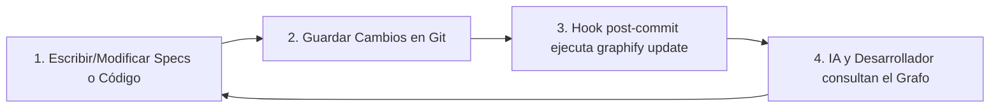

# Contrato de Flujo de Trabajo: Iteración Dinámica del Grafo

Este documento es el contrato operativo que rige cómo mantener el grafo de conocimiento de **JANA OS** sincronizado y alineado dinámicamente con el desarrollo del código y las especificaciones.

---

## 1. Inicialización del Repositorio de Control de Cambios

Para que los ganchos automáticos (hooks) de Graphify puedan operar, el espacio de trabajo debe ser un repositorio Git.

```powershell
# 1. Inicializar repositorio git si no existe
git init

# 2. Agregar archivos actuales y realizar commit inicial
git add .
git commit -m "chore: setup specs and rules for JANA OS"

# 3. Instalar los ganchos de post-commit de Graphify
graphify hook install
```

---

## 2. El Ciclo de Desarrollo Guiado por Grafo (Workflow Loop)

Cada iteración de desarrollo de código o diseño sigue el siguiente flujo de trabajo mandatorio:



1.  **Modificación o Creación:** El desarrollador o la IA editan las especificaciones en `docs/` o escriben código fuente (`.ts`, `.py`, `.css`, etc.).
2.  **Commit de Cambios:** Se realiza el commit de los cambios correspondientes:
    ```bash
    git add .
    git commit -m "feat: implement user tables and Auth services"
    ```
3.  **Actualización Automática:** El gancho `post-commit` de Git ejecuta de forma transparente:
    ```bash
    graphify update .
    ```
    Esto actualiza las firmas SHA256 de los archivos modificados y regenera de forma incremental `graph.json` y `graph.html`.
4.  **Consulta:** Las IAs leen el grafo actualizado antes de su siguiente intervención, asegurando consistencia.

---

## 3. Comandos de Emergencia y Mantenimiento

*   **Forzar Recompilación Completa:** Si se realizan refactorizaciones masivas o eliminaciones de archivos y el grafo reporta inconsistencias, se debe forzar la recompilación completa:
    ```bash
    graphify update . --force
    ```
*   **Comprobar Estado del Gancho:** Para verificar que los ganchos de Git están correctamente enlazados y activos:
    ```bash
    graphify hook status
    ```
*   **Actualización Manual sin Git:** En caso de trabajar temporalmente fuera de Git, ejecuta la actualización manual tras cada cambio significativo:
    ```bash
    graphify update .
    ```
