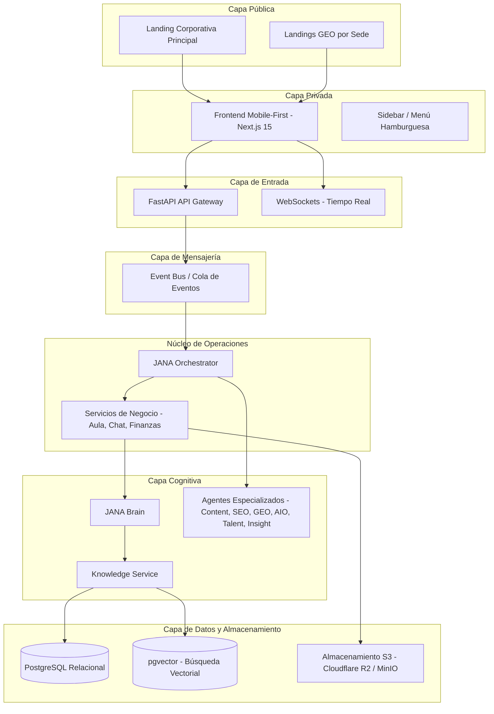
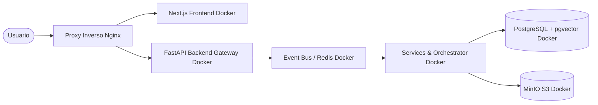

# JANA OS - Especificación de Visión Arquitectónica

Este documento describe la arquitectura técnica de **JANA OS** (Educational and Artistic Operating System), estructurada para evitar cuellos de botella de acoplamiento en FastAPI mediante el uso de un Event Bus e intermediarios de servicios.

## 1. Estructura de Capas del Sistema (Arquitectura Desacoplada)

---

## 2. Stack Tecnológico

### 2.1 Frontend
*   **Framework:** Next.js 15 (App Router), React 19, TypeScript.
*   **Diseño y Componentes:** TailwindCSS y shadcn/ui.
*   **Animaciones:** Framer Motion para transiciones suaves e interfaces dinámicas.
*   **Visualización de Grafos:** React Flow para el MVP de JANA Talent Graph en Desktop y representación simplificada en Mobile; escalable a Three.js / React Three Fiber.

### 2.2 Backend y Mensajería
*   **API Gateway & Routing:** Python y FastAPI. Limita sus responsabilidades a enrutamiento, validación de esquemas de entrada y autenticación.
*   **Event Bus (Desacoplamiento):** Cola de mensajería (ej. RabbitMQ, Redis Pub/Sub o sistema de colas en memoria para el MVP) que distribuye eventos operativos de forma asíncrona.
*   **Tiempo Real:** WebSockets integrados en FastAPI para la mensajería de JANA Chat y notificaciones push.
*   **Autenticación:** Better Auth o Auth.js con tokens JWT y control de acceso basado en roles multi-tenant.

### 2.3 Capa de Datos y Almacenamiento
*   **Base de Datos Relacional:** PostgreSQL para datos de negocio estructurados (Usuarios, Clases, Sedes, Eventos Financieros).
*   **Base de Datos Vectorial:** `pgvector` en PostgreSQL para almacenamiento de embeddings y búsqueda de similitud coseno.
*   **Almacenamiento de Archivos:** API S3-Compatible utilizando Cloudflare R2 / MinIO.

---

## 3. Arquitectura del Motor de IA (JANA BRAIN & KNOWLEDGE SERVICE)

### 3.1 JANA Orchestrator
Es el cerebro operacional del sistema. Escucha eventos del **Event Bus** (como `CLASE_FINALIZADA` o `NUEVO_MENSAJE`) y despacha las tareas a los servicios académicos o activa los agentes correspondientes en segundo plano de manera asíncrona.

### 3.2 JANA Brain y Agentes Especializados
*   **JANA Brain:** Interfaz unificada y agnóstica para interactuar con LLMs (OpenAI, Gemini, Anthropic), encargada de la interpretación contextual de eventos y evolución.
*   **Content Agent / SEO Agent / GEO Agent / AIO Agent:** Pipeline de generación automática de blogs y landings adaptados a búsquedas tradicionales e IA.
*   **Talent Agent & Insight Agent:** Generación de métricas de progreso de estudiantes y recomendaciones operativas para directores de sede.

### 3.3 Knowledge Service
Es el guardián de la base de datos vectorial. Centraliza la creación de embeddings, la ejecución del RAG y el **filtrado previo de seguridad** (validando que los embeddings consultados pertenezcan al mismo tenant/sede del usuario y cumplan las reglas de visibilidad por rol y nivel de sensibilidad) antes de remitir contexto a JANA Brain.

---

## 4. Infraestructura y Despliegue

El despliegue inicial se realizará en un VPS KVM 2 de Hostinger empleando Docker y Docker Compose para garantizar portabilidad.

