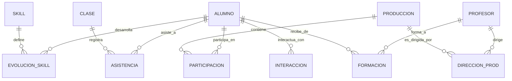

# JANA OS - Especificación de Modelos de Datos y Grafo de Talento

Este documento define la estructura de datos relacional, el grafo enriquecido de talento y las tablas de vectores optimizadas para pgvector.

---

## 1. Esquema Relacional (PostgreSQL)

Todo el esquema implementa **Row Level Security (RLS)** a nivel de base de datos utilizando el campo `tenant_id` y `sede_id` para garantizar el aislamiento multi-sede.

### 1.1 Sedes y Usuarios
*   `sedes`: Representa cada escuela física o sucursal del tenant.
    *   `id`: UUID (Primary Key)
    *   `tenant_id`: UUID
    *   `nombre`: VARCHAR(100) (Ej: "JANA Alcalá de Henares")
    *   `codigo_geo`: VARCHAR(50) (Para SEO/GEO local)
*   `usuarios`: Entidad base de accesos del sistema.
    *   `id`: UUID (Primary Key)
    *   `tenant_id`: UUID
    *   `nombre`: VARCHAR(100)
    *   `email`: VARCHAR(150) (Unique)
    *   `password_hash`: VARCHAR(255)
    *   `rol`: VARCHAR(30) (Valores: `alumno`, `profesor`, `administracion`, `direccion`)
    *   `sede_principal_id`: UUID (Foreign Key a `sedes`)
*   `usuario_sedes`: Tabla intermedia para profesores o directivos que operan en múltiples sedes.
    *   `usuario_id`: UUID (Foreign Key a `usuarios`)
    *   `sede_id`: UUID (Foreign Key a `sedes`)

### 1.2 Clases y Evaluaciones
*   `clases`: Sesiones académicas.
    *   `id`: UUID (Primary Key)
    *   `sede_id`: UUID (Foreign Key a `sedes`)
    *   `profesor_id`: UUID (Foreign Key a `usuarios`)
    *   `nombre`: VARCHAR(150)
    *   `fecha_hora`: TIMESTAMP
    *   `duracion_minutos`: INTEGER
*   `evaluaciones`: Notas y feedback.
    *   `id`: UUID (Primary Key)
    *   `alumno_id`: UUID (Foreign Key a `usuarios`)
    *   `evaluador_id`: UUID (Foreign Key a `usuarios`)
    *   `clase_id`: UUID (Foreign Key a `clases`, opcional)
    *   `nota`: NUMERIC(4, 2)
    *   `comentarios`: TEXT
    *   `fecha`: TIMESTAMP

### 1.3 Finanzas y Verifactu
*   `eventos_financieros`: Registro de cobros o pagos en el MVP para sentar bases ERP y Verifactu.
    *   `id`: UUID (Primary Key)
    *   `tenant_id`: UUID
    *   `sede_id`: UUID (Foreign Key a `sedes`)
    *   `usuario_id`: UUID (Foreign Key a `usuarios`)
    *   `monto`: NUMERIC(10, 2)
    *   `tipo`: VARCHAR(50) (Valores: `matricula`, `mensualidad`, `taller`, `intensivo`)
    *   `estado`: VARCHAR(30) (Valores: `pendiente`, `completado`, `fallido`)
    *   `verifactu_estado`: VARCHAR(50) (Valores: `no_aplicable`, `registrado`, `enviado`, `error`)
    *   `verifactu_hash`: VARCHAR(256) (Hash encadenado para cumplimiento legal)
    *   `creado_en`: TIMESTAMP

---

## 2. Grafo Vivo (JANA TALENT GRAPH)

Las relaciones del grafo no son conexiones booleanas simples; contienen metadatos dinámicos enriquecidos que reflejan eventos medibles.



### 2.1 Metadatos de las Relaciones

*   **Alumno --[PARTICIPA]--> Producción:**
    *   `rol_asignado`: VARCHAR (ej. principal, elenco, técnico)
    *   `personaje`: VARCHAR
    *   `fecha_incorporacion`: DATE
    *   `fecha_finalizacion`: DATE
    *   `horas_ensayo`: INTEGER
    *   `asistencia_porcentaje`: NUMERIC(5, 2)
    *   `intervenciones_cantidad`: INTEGER
    *   `escenas_participadas`: TEXT[]
    *   `nivel_responsabilidad`: INTEGER (1-10)
    *   `evaluacion_final`: TEXT
    *   `score_ia_impacto_artistico`: NUMERIC(4, 2) (Generado por JANA Brain)
*   **Alumno --[ASISTE]--> Clase:**
    *   `fecha`: DATE
    *   `estado`: VARCHAR (presente, ausente, justificado)
    *   `puntualidad`: BOOLEAN
    *   `participacion_score`: INTEGER (1-5)
    *   `valoracion_docente`: TEXT
*   **Alumno --[DESARROLLA]--> Skill:**
    *   `nivel_actual`: INTEGER (1-10)
    *   `nivel_historico`: JSONB (Historial de niveles con timestamps)
    *   `velocidad_mejora`: NUMERIC(4, 2) (Delta de incremento mensual)
    *   `evidencias_cantidad`: INTEGER (Número de tareas/evaluaciones que lo respaldan)
    *   `evaluacion_media`: NUMERIC(4, 2)
    *   `confianza_ia`: NUMERIC(3, 2) (Margen de confianza del análisis de JANA Brain)
*   **Profesor --[FORMA]--> Alumno:**
    *   `horas_acumuladas`: INTEGER
    *   `asignaturas_impartidas`: VARCHAR[]
    *   `producciones_compartidas`: UUID[]
    *   `influencia_pedagogica_score`: NUMERIC(3, 2) (Cálculo IA basado en la mejora de skills del alumno)
*   **Profesor --[DIRIGE]--> Producción:**
    *   `duracion_meses`: INTEGER
    *   `cantidad_participantes`: INTEGER
    *   `valoracion_alumnado`: NUMERIC(4, 2)
    *   `impacto_artistico_score`: NUMERIC(4, 2)
*   **Alumno --[INTERACTÚA]--> Alumno:**
    *   `frecuencia_interaccion`: INTEGER (Basado en clases y producciones compartidas)
    *   `afinidad_artistica_ia`: NUMERIC(3, 2)
    *   `sinergia_detectada`: TEXT (Comportamiento colaborativo identificado por la IA)

### 2.2 Taxonomía de Skills
El sistema utiliza un **Modelo Híbrido** (taxonomía base estática + ampliación dinámica por IA).

*   **Skills Estáticas (Estructurales):**
    *   *Interpretación:* Expresión emocional, Improvisación, Construcción de personaje, Escucha activa, Presencia escénica.
    *   *Canto:* Afinación, Respiración, Técnica vocal, Interpretación vocal.
    *   *Danza:* Coordinación, Ritmo, Técnica, Expresión corporal.
    *   *Música:* Instrumento, Lectura musical, Armonía, Interpretación.
*   **Skills Dinámicas (Emergentes por IA):**
    *   Creadas automáticamente por JANA Brain al analizar descripciones de profesores (ej. "Liderazgo escénico", "Capacidad coral", "Gestión emocional"). Se guardan asociadas a una de las cuatro categorías estáticas principales.

---

## 3. Esquema Vectorial y Seguridad RAG (pgvector)

Todos los embeddings de texto del sistema se almacenan en una tabla dedicada a vectores con metadatos específicos que controlan el filtrado de seguridad por parte del RAG antes de alimentar los modelos.

### 3.1 Estructura de la Tabla de Embeddings
```sql
CREATE EXTENSION IF NOT EXISTS pgvector;

CREATE TABLE jana_embeddings (
    id UUID PRIMARY KEY DEFAULT gen_random_uuid(),
    tenant_id UUID NOT NULL,
    sede_id UUID NOT NULL,
    entidad_tipo VARCHAR(50) NOT NULL, -- 'alumno', 'profesor', 'produccion', 'recurso', 'conversacion', 'evaluacion', 'contenido_web'
    entidad_id UUID NOT NULL, -- ID del registro en su tabla original
    texto_contenido TEXT NOT NULL, -- Fragmento de texto crudo
    embedding vector(1536) NOT NULL, -- Embedding (dimensión 1536 para OpenAI/Gemini/etc.)
    
    -- Metadatos de seguridad RAG
    visibilidad_rol VARCHAR(30) NOT NULL, -- 'public', 'profesor', 'administracion', 'direccion'
    propietario_usuario_id UUID, -- Propietario del documento/mensaje (NULL si es de la organización)
    nivel_sensibilidad VARCHAR(30) NOT NULL -- 'PUBLIC', 'INTERNAL', 'CONFIDENTIAL', 'RESTRICTED' (Menores)
);

CREATE INDEX ON jana_embeddings USING hnsw (embedding vector_cosine_ops);
```

### 3.2 Niveles de Sensibilidad del RAG
1.  **PUBLIC:** Documentación de marketing, artículos de blog, landings de sedes. Visible por cualquier rol y usuarios no autenticados.
2.  **INTERNAL:** Contenido académico, temarios, recursos de profesores. Visible por profesores, administración y dirección.
3.  **CONFIDENTIAL:** Datos financieros agregados, rendimiento comercial por sede, métricas de profesorado. Solo accesible por administración y dirección.
4.  **RESTRICTED:** Evaluaciones de alumnos individuales (muchos de ellos menores de edad), feedbacks personales y chats privados. Solo accesible por el alumno propietario, sus padres/tutores vinculados, su profesor directo y dirección académica.
