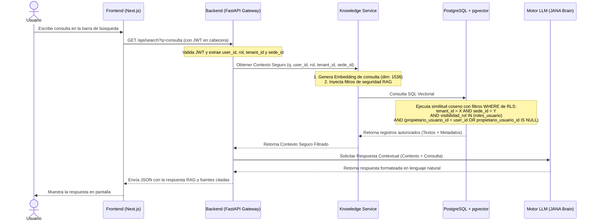
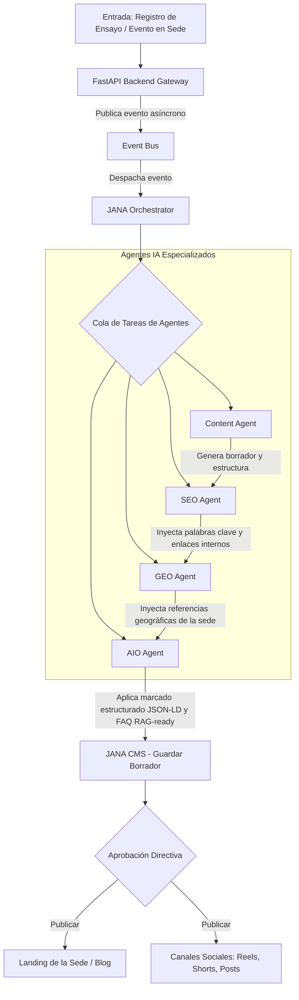
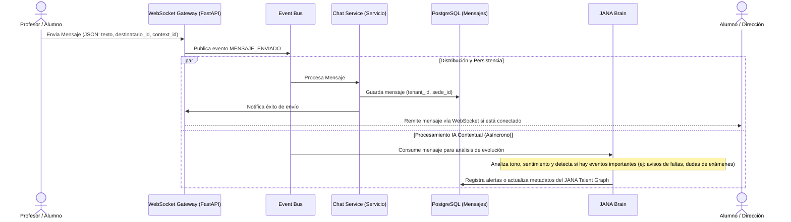
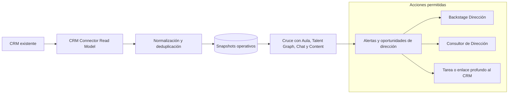

# JANA OS - Especificación de Requisitos Funcionales y Procesos de IA

Este documento detalla los flujos de trabajo funcionales y procesos integrados del sistema, enfocándose en la interacción de la Inteligencia Artificial y la seguridad RAG.

---

## 1. Búsqueda Global Segura (pgvector + RAG)

Este flujo garantiza que el modelo de lenguaje (LLM) nunca tenga acceso a datos confidenciales o pertenecientes a menores que no correspondan con los permisos del usuario activo, delegando la seguridad y los vectores en el **Knowledge Service**.

---

## 2. Generación de Contenido Automática (JANA Content Engine)

Este pipeline desacopla la API de FastAPI del procesamiento asíncrono y pesado de los agentes mediante el **Event Bus** y **JANA Orchestrator**.

### 2.1 Detalle del Flujo de Trabajo
1.  **Entrada:** El profesor registra en JANA Aula que la clase de canto de la sede "Majadahonda" ha completado el montaje coral de la escena 3 de una producción.
2.  **Publicación de Evento:** FastAPI recibe la petición HTTP, registra el cambio básico en base de datos y publica el evento `PRODUCCION_MODIFICADA` en el **Event Bus**. La respuesta HTTP retorna inmediatamente al profesor, garantizando cero retrasos en el frontend.
3.  **Orquestación:** **JANA Orchestrator** consume el evento del Event Bus y desencadena la cola de tareas del motor de contenidos.
4.  **Generación de Contenido:**
    *   **Content Agent** redacta un artículo sobre el proceso de montaje coral y las técnicas utilizadas, aplicando las directrices de la [Regla de Redacción Persuasiva y Accesible (Copywriting)](../.agents/rules/copywriting.md).
    *   **SEO Agent, GEO Agent y AIO Agent** ajustan, localizan y estructuran el contenido en formato de preguntas y respuestas cortas optimizadas para búsquedas de IA y buscadores tradicionales, conforme a la [Regla de SEO, GEO y AIO](../.agents/rules/seo_geo_aio.md).
5.  **CMS:** Se guarda en el CMS interno como borrador pendiente de aprobación por el Administrador.

---

## 3. Mensajería en Tiempo Real (JANA Chat)

El sistema de mensajería utiliza WebSockets y el Event Bus para distribuir mensajes de forma asíncrona a través de las sedes y activar análisis en segundo plano.

---

## 4. Adaptador de CRM externo e inteligencia de dirección

El CRM existente de la escuela se mantiene como sistema de registro. JANA OS no sustituye la herramienta actual, no emite facturas y no fuerza migraciones. Su función es importar datos autorizados del CRM, normalizarlos y cruzarlos con actividad académica, comunicación, contenidos, asistencia y Talent Graph para convertirlos en decisiones directivas.

*   **Modo lectura por defecto:** El MVP importa leads, matrículas, estados de pago, importes, origen de captación y estados fiscales si el CRM los expone. No modifica registros contables.
*   **CRM como fuente de verdad:** Cualquier corrección de cobro, factura, estado fiscal o ficha comercial se realiza en el CRM de origen.
*   **Inteligencia cruzada:** JANA OS detecta señales como riesgo de abandono con pago pendiente, sede con alta captación y baja asistencia, profesorado saturado frente a demanda comercial, o contenidos que generan oportunidad de inscripción.
*   **Writeback opcional futuro:** En versión avanzada puede crear tareas, notas o deep links hacia el CRM, siempre bajo permisos explícitos y con trazabilidad.
*   **CRO Ético:** Las landings, clases de prueba e inscripciones deben seguir la [Regla de Optimización de la Tasa de Conversión Ética (CRO Ético)](../.agents/rules/ethical_cro.md), evitando patrones oscuros y separando captación web de gestión financiera.
