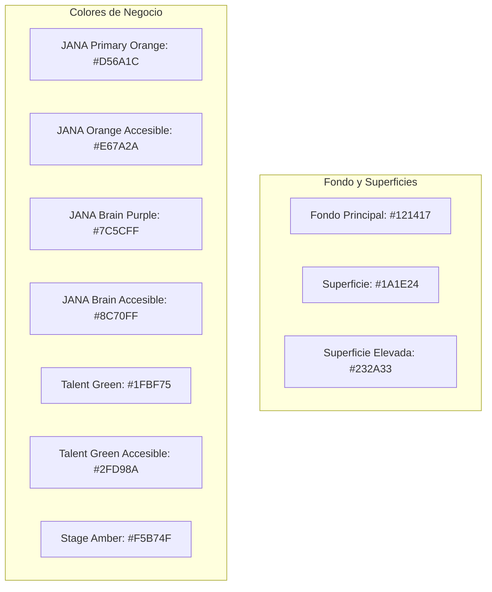

# JANA OS - Especificación del Sistema de Diseño (UI/UX)

Este documento define la identidad visual, la paleta de colores y las directrices de experiencia de usuario (UX) para **JANA OS** ("JANA Creative Stage System"), garantizando el cumplimiento obligatorio de accesibilidad **WCAG 2.2 AA**.

---

## 1. Principios Fundamentales
*   **Identidad Artística:** JANA OS debe percibirse como el ecosistema digital donde vive y evoluciona el talento artístico de la escuela, alejándose de los patrones fríos de los ERPs o LMS corporativos tradicionales.
*   **Mobile-First:** Todo componente se diseña, maqueta y optimiza primero para dispositivos móviles, escalando progresivamente a pantallas de escritorio. Para más detalles sobre interacciones y arquitectura de información visual, consulte la [Regla de Diseño de Experiencia de Usuario (UX)](file:///D:/JANA/.agents/rules/ux_design.md).
*   **Accesibilidad desde el Día 1:** El sistema de diseño integra el cumplimiento estricto del estándar **WCAG 2.2 AA** de forma nativa. Para ver las pautas de codificación y diseño obligatorias, consulte la [Regla de Accesibilidad Avanzada WCAG 2.2](file:///D:/JANA/.agents/rules/wcag_accessibility.md).
*   **Focalización en el Talento:** Cada pantalla debe responder afirmativamente a la pregunta: *¿Ayuda esto a desarrollar, organizar o comprender mejor el talento artístico?*. Si la respuesta es negativa, el elemento es superfluo y se elimina.

---

## 2. Paleta de Colores y Tokens CSS

El sistema utiliza colores optimizados para ofrecer un contraste excepcional sobre el fondo oscuro y define variantes específicas para alcanzar ratios de contraste accesibles en textos pequeños.



### 2.1 Variables CSS del Tema (Tailwind CSS v4)
```css
:root {
  /* Fondo y Superficies */
  --background: #121417;
  --surface: #1A1E24;
  --surface-elevated: #232A33;

  /* JANA Orange (Corporativo) */
  --jana-primary: #D56A1C;
  --jana-primary-accessible: #E67A2A;

  /* JANA Brain (Inteligencia Artificial) */
  --brain: #7C5CFF;
  --brain-accessible: #8C70FF;

  /* Talent Green (Grafo de Talento) */
  --talent: #1FBF75;
  --talent-accessible: #2FD98A;

  /* Stage Amber (Producciones) */
  --production: #F5B74F;

  /* Estados */
  --success: #1FBF75;
  --warning: #F5B74F;
  --error: #E5484D;
  --info: #4C8DFF;
}
```

---

## 3. Tipografía y Escala

Se combinan dos fuentes tipográficas para equilibrar la estética creativa y la legibilidad de datos densos.

*   **Tipografía Principal (Outfit):** Utilizada en cabeceras, títulos, menús de navegación primarios y marcas de componentes principales.
*   **Tipografía Secundaria (Inter):** Utilizada en tablas de datos, dashboards, campos de entrada de formularios y bloques de texto extensos.

### Escala de Tamaños
El tamaño de fuente mínimo para cualquier elemento interactivo o cuerpo de texto es de **16px** (para evitar zooms automáticos en iOS y garantizar legibilidad).
*   `H1`: 36px (Outfit)
*   `H2`: 30px (Outfit)
*   `H3`: 24px (Outfit)
*   `H4`: 20px (Outfit)
*   `Body`: 16px (Inter)
*   `Small / Caption`: 14px (Inter)

---

## 4. Pautas de Accesibilidad e Interacción

### 4.1 Áreas Táctiles y Controles
*   **Tamaño Mínimo:** Todos los botones, enlaces interactivos y elementos accionables deben tener una altura y área táctil mínima de **44px × 44px** para facilitar la pulsación en dispositivos móviles.
*   **Focus Visible:** Está estrictamente prohibido eliminar el contorno de enfoque (`outline: none`). Se debe asegurar el uso de `outline: auto` o anillos de enfoque de alto contraste al navegar con teclado.
*   **Navegación Teclado:** Todo el flujo de navegación de la aplicación debe poder operarse completamente mediante las teclas `TAB`, `SHIFT + TAB`, `ENTER` y `ESC`.

### 4.2 Lectores de Pantalla y Accesibilidad Web
*   Todos los campos de formulario (`input`) deben poseer una etiqueta `<label>` explícita y asociada.
*   Uso mandatorio de atributos `aria-label`, `aria-expanded` (para menús y sidebars), `aria-describedby` (para errores y descripciones contextuales) y regiones `aria-live` para alertar al usuario de cambios dinámicos del sistema sin refrescar la página.
*   **Talent Graph Accesible:** Junto a la visualización 3D del grafo interactivo (Three.js/R3F), se debe ofrecer de forma obligatoria y accesible una **vista alternativa en formato tabla** que exponga claramente los nodos, sus tipos, relaciones y metadatos a los lectores de pantalla.

### 4.3 Motion Design (Movimiento con Significado)
Las animaciones (implementadas vía Framer Motion) deben aportar claridad en la transición de estados (ej. flujos de carga de la IA o reorganización de nodos en el grafo), nunca ser meros adornos.
*   **Respeto a Preferencias del Usuario:** Es obligatorio implementar soporte para `@media (prefers-reduced-motion: reduce)`. Cuando esta preferencia esté activa en el sistema operativo del usuario, se desactivarán todas las transiciones complejas, desplazamientos automáticos y zooms del grafo.

---

## 5. Aplicación del Color por Módulos
Para facilitar la orientación espacial del usuario en la plataforma, cada sección tiene un acento o gradiente distintivo:
*   **JANA Aula (LMS):** Dominancia de `var(--jana-primary)`.
*   **JANA Chat (Mensajería):** Dominancia de `#3B82F6` (Azul oficial de comunicación).
*   **JANA Brain (IA Contextual):** Dominancia de `var(--brain)`.
*   **JANA Talent Graph:** Gradiente de `var(--talent)` a `var(--brain)`.
*   **JANA Content (Engine & Agents):** Gradiente de `var(--production)` a `var(--jana-primary)`.
*   **JANA Panel (Administración):** Predominio neutro de superficies; los colores de acento se usan exclusivamente para alertar o enfatizar KPIs críticos.
